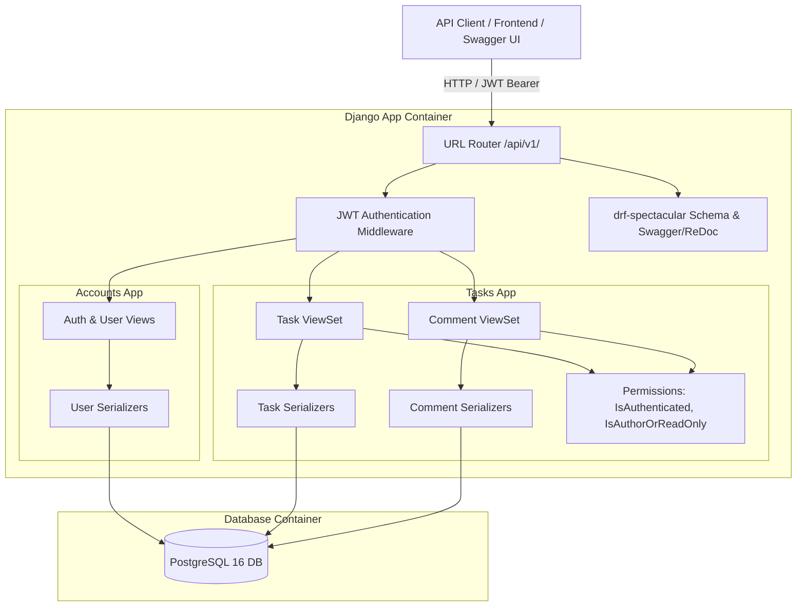

# Requirements

### Overview & Goals
The goal is to develop a containerized, production-ready Task Management System API using Django, Django REST Framework (DRF), and PostgreSQL. The application enables users to manage their daily workflow: creating and assigning tasks, tracking task completion status, and collaborating via task comments. The system features JWT-based authentication and interactive OpenAPI 3.0 documentation (Swagger & ReDoc).

### Scope
- **In Scope:**
  - Containerization with Docker and Docker Compose (Django web app + PostgreSQL 16 database).
  - User authentication and authorization via JWT (`djangorestframework-simplejwt`), including user registration, login, and token refresh.
  - User discovery endpoint to support task assignment.
  - Full Task CRUD (Create, Read, Update, Delete) with status tracking (`TODO`, `IN_PROGRESS`, `DONE`), priority levels (`LOW`, `MEDIUM`, `HIGH`), due dates, and assignments.
  - Task assignment action to assign or reassign tasks to other registered users.
  - Task completion action to transition tasks to the completed state.
  - Task search, filtering (by status, priority, assignee), and ordering (by creation date, due date).
  - Comments subsystem allowing users to post comments on tasks with author attribution.
  - Permission controls (authenticated access, author-only modifications where applicable).
  - Interactive API documentation via `drf-spectacular` (Swagger UI & ReDoc).
  - Automated test suite with `pytest-django` covering core functionality.
  - Code style and quality enforcement (PEP 8, Ruff, type checks).

- **Out of Scope:**
  - Frontend SPA (React/Vue/etc.) — the focus is purely on the REST API backend.
  - Third-party OAuth 2.0 social providers (Google/GitHub login) — standard JWT authentication satisfies the requirements.
  - File/attachment uploads for tasks or comments.
  - Real-time WebSockets / push notifications.

### User Stories
- **US-1 (Registration & Login):** As a new user, I want to register an account and obtain a JWT token so that I can securely interact with the system.
- **US-2 (Task Creation & Management):** As an authenticated user, I want to create, edit, view, and delete tasks so that I can manage my work.
- **US-3 (Task Assignment):** As a user, I want to assign a task to another user so that we can collaborate on deliverables.
- **US-4 (Task Completion):** As a task assignee or creator, I want to mark a task as completed so that progress is clearly visible.
- **US-5 (Task Collaboration):** As an authenticated user, I want to comment on tasks to discuss requirements, provide updates, or ask questions.
- **US-6 (Task Filtering & Search):** As a user, I want to filter tasks by status, priority, or assignee and search by title/description so that I can quickly find relevant items.
- **US-7 (API Exploration):** As an API consumer or reviewer, I want to explore and test endpoints via Swagger UI and ReDoc to understand the request/response contracts.

### Functional Requirements
- **Authentication & Users (`/api/v1/auth/`):**
  - `POST /register/` — Accepts username, email, password; returns created user data.
  - `POST /token/` — Accepts credentials; returns JWT `access` and `refresh` tokens.
  - `POST /token/refresh/` — Accepts `refresh` token; returns new `access` token.
  - `GET /users/` — Returns list of registered users (`id`, `username`, `email`) for task assignment dropdowns/selections.
- **Tasks (`/api/v1/tasks/`):**
  - `GET /` — List tasks with pagination, filtering (`status`, `priority`, `assigned_to`, `created_by`), ordering (`due_date`, `created_at`, `priority`), and search (`title`, `description`).
  - `POST /` — Create task with title, description, due date, priority, and optional assignee (creator set automatically to `request.user`).
  - `GET /{id}/` — Retrieve detailed task info including creator and assignee details.
  - `PUT /{id}/` & `PATCH /{id}/` — Update task details.
  - `DELETE /{id}/` — Delete task.
  - `POST /{id}/complete/` — Custom action to mark task status as `DONE`.
  - `POST /{id}/assign/` — Custom action to assign or reassign task to a specified user.
- **Comments (`/api/v1/tasks/{id}/comments/` & `/api/v1/comments/{id}/`):**
  - `GET /tasks/{id}/comments/` — List all comments for the specified task ordered chronologically.
  - `POST /tasks/{id}/comments/` — Add a new comment to the task (author set to `request.user`).
  - `GET /comments/{id}/` — Retrieve a single comment.
  - `PATCH /comments/{id}/` — Edit comment (restricted to comment author).
  - `DELETE /comments/{id}/` — Delete comment (restricted to comment author or task creator).
- **API Documentation (`/api/docs/`):**
  - `GET /api/schema/` — OpenAPI 3.0 YAML/JSON schema.
  - `GET /api/docs/swagger/` — Interactive Swagger UI.
  - `GET /api/docs/redoc/` — ReDoc UI.

### Non-Functional Requirements
- **Code Standards:** 100% adherence to PEP 8, formatted and linted with Ruff.
- **Containerization:** Self-contained `docker-compose up` setup launching both PostgreSQL and the Django application with zero manual host configuration.
- **Database:** PostgreSQL 16 with indexed foreign keys and timestamps for efficient queries.
- **Test Coverage:** Comprehensive unit and integration test suite with `pytest-django` achieving >85% test coverage across models, serializers, views, and permissions.

# Technical Design

### Current Implementation
The repository was initialized using a template with `uv` package management, `hatchling` build backend, `ruff` for linting/formatting, `ty` for static type checking, and `pytest` for testing. The source folder currently contains placeholder files (`src/taskie/foo.py`).

### Key Decisions
1. **Modular Django Application Architecture:**
   - Organize domain logic into `accounts` (user registration, profile listing, auth) and `tasks` (tasks and comments domain models, views, serializers).
   - Rationale: Promotes high cohesion, separation of concerns, and clean import boundaries.
2. **JWT Authentication via `djangorestframework-simplejwt`:**
   - Use stateless JWT tokens (`access` token with short lifetime, `refresh` token with longer lifetime).
   - Rationale: Standard for modern REST APIs, stateless scaling, and native DRF integration.
3. **OpenAPI 3.0 Documentation via `drf-spectacular`:**
   - Auto-generate OpenAPI schema with schema customization via `@extend_schema`.
   - Serve both Swagger UI (`/api/docs/swagger/`) and ReDoc (`/api/docs/redoc/`).
4. **Database & Configuration Management:**
   - Use PostgreSQL in Docker container and development/production environments.
   - Use `python-dotenv` / environment variables for settings (`DATABASE_URL`, `SECRET_KEY`, `DEBUG`, `ALLOWED_HOSTS`).
   - Use SQLite fallback for rapid local test execution in CI/pytest when desired.

### Proposed Changes
- **Project Structure:**
  - Create Django project `config` in `src/taskie/config` containing `settings.py`, `urls.py`, `wsgi.py`, `asgi.py`.
  - Create `src/taskie/apps/accounts/` and `src/taskie/apps/tasks/`.
  - Add `manage.py` in project root (or executable via `python -m taskie.manage`).
- **Dependencies (`pyproject.toml`):**
  - Add: `django>=5.1`, `djangorestframework>=3.15`, `djangorestframework-simplejwt>=5.3`, `drf-spectacular>=0.28`, `psycopg[binary]>=3.2`, `django-filter>=24.3`, `python-dotenv>=1.0`.
  - Add dev dependencies: `pytest-django>=4.9`, `factory-boy>=3.3`.
- **Docker Setup:**
  - Update `Dockerfile` to install dependencies via `uv`, expose port 8000, and run migrations & Gunicorn/runserver.
  - Add `docker-compose.yml` with `web` service and `db` service (`postgres:16-alpine`), healthcheck on DB, and persistent volume.

### Data Models & Contracts
```python

# accounts/models.py (standard Django User or custom model)

# tasks/models.py

class TaskStatus(models.TextChoices):
    TODO = "TODO", "To Do"
    IN_PROGRESS = "IN_PROGRESS", "In Progress"
    DONE = "DONE", "Done"

class TaskPriority(models.TextChoices):
    LOW = "LOW", "Low"
    MEDIUM = "MEDIUM", "Medium"
    HIGH = "HIGH", "High"

class Task(models.Model):
    title = models.CharField(max_length=255)
    description = models.TextField(blank=True)
    status = models.CharField(max_length=20, choices=TaskStatus.choices, default=TaskStatus.TODO)
    priority = models.CharField(max_length=20, choices=TaskPriority.choices, default=TaskPriority.MEDIUM)
    due_date = models.DateTimeField(null=True, blank=True)
    created_by = models.ForeignKey(User, on_delete=models.CASCADE, related_name="created_tasks")
    assigned_to = models.ForeignKey(User, on_delete=models.SET_NULL, null=True, blank=True, related_name="assigned_tasks")
    created_at = models.DateTimeField(auto_now_add=True)
    updated_at = models.DateTimeField(auto_now=True)

class Comment(models.Model):
    task = models.ForeignKey(Task, on_delete=models.CASCADE, related_name="comments")
    author = models.ForeignKey(User, on_delete=models.CASCADE, related_name="task_comments")
    content = models.TextField()
    created_at = models.DateTimeField(auto_now_add=True)
    updated_at = models.DateTimeField(auto_now=True)
```

### Architecture Diagram


### File Structure
```
taskie/
├── Dockerfile
├── docker-compose.yml
├── Makefile
├── pyproject.toml
├── src/
│   └── taskie/
│       ├── __init__.py
│       ├── manage.py
│       ├── config/
│       │   ├── __init__.py
│       │   ├── asgi.py
│       │   ├── settings.py
│       │   ├── urls.py
│       │   └── wsgi.py
│       └── apps/
│           ├── accounts/
│           │   ├── __init__.py
│           │   ├── apps.py
│           │   ├── models.py
│           │   ├── serializers.py
│           │   ├── urls.py
│           │   └── views.py
│           └── tasks/
│               ├── __init__.py
│               ├── apps.py
│               ├── filters.py
│               ├── models.py
│               ├── permissions.py
│               ├── serializers.py
│               ├── urls.py
│               └── views.py
└── tests/
    ├── conftest.py
    ├── test_accounts.py
    ├── test_comments.py
    └── test_tasks.py
```

### Risks & Mitigations
- **Database connection race condition in Docker:**
  - *Risk:* Django starts before PostgreSQL is ready to accept connections.
  - *Mitigation:* Configure `docker-compose.yml` with healthcheck on the `db` service (`pg_isready`) and `depends_on: db: condition: service_healthy`.
- **Query performance (N+1 queries) when fetching tasks with assignees and comments:**
  - *Risk:* Fetching tasks causes multiple database hits per item.
  - *Mitigation:* Use `select_related('created_by', 'assigned_to')` and `prefetch_related('comments')` in `TaskViewSet.get_queryset()`.

# Testing

### Validation Approach
Automated tests will be implemented using `pytest` and `pytest-django` utilizing DRF's `APIClient`. Test fixtures and factories (`factory-boy` / model fixtures in `conftest.py`) will provide repeatable, isolated test data.

### Key Scenarios
- **Authentication & User Management:**
  - Register new user with valid data -> `201 Created`.
  - Register with existing username/email or weak password -> `400 Bad Request`.
  - Obtain JWT tokens with valid credentials -> `200 OK` (returns `access` and `refresh`).
  - Refresh access token with valid refresh token -> `200 OK` (returns new `access`).
  - Access protected endpoint without token -> `401 Unauthorized`.
  - List users while authenticated -> `200 OK` with user list.
- **Task Lifecycle & Assignment:**
  - Create task with title, description, due date, priority -> `201 Created`, creator matches `request.user`.
  - Create task and assign to another user (`assigned_to`) -> `201 Created` with valid assignee details.
  - Retrieve task list with pagination and verify response structure -> `200 OK`.
  - Filter tasks by `status=TODO`, `priority=HIGH`, and `assigned_to=<id>` -> verified correct subset.
  - Search tasks by query keyword -> verified matching titles and descriptions.
  - Update task details via `PUT`/`PATCH` -> `200 OK` with updated fields.
  - Call `/api/v1/tasks/{id}/complete/` -> `200 OK`, task status transitions to `DONE`.
  - Call `/api/v1/tasks/{id}/assign/` with `{ "assigned_to": <user_id> }` -> `200 OK`, task assignee updated.
  - Delete task -> `204 No Content`.
- **Comments:**
  - Add comment to a task -> `201 Created`, author is `request.user`, comment linked to task.
  - List comments for a task -> `200 OK` with chronological list.
  - Edit own comment -> `200 OK`.
  - Attempt to edit another user's comment -> `403 Forbidden`.
  - Delete own comment -> `204 No Content`.
- **API Documentation:**
  - Request `/api/schema/` -> `200 OK` returning valid OpenAPI 3.0 schema.
  - Request `/api/docs/swagger/` and `/api/docs/redoc/` -> `200 OK` returning HTML documentation pages.

### Edge Cases
- Task creation with invalid due date or missing mandatory title.
- Assigning a task to a non-existent user ID -> `400 Bad Request`.
- Accessing or modifying a non-existent task ID -> `404 Not Found`.
- Posting comments on a non-existent task ID -> `404 Not Found`.
- Empty or whitespace-only comment content -> `400 Bad Request`.
- Expired or malformed JWT token in `Authorization` header -> `401 Unauthorized`.

### Test Changes
- Add `tests/conftest.py` with reusable fixtures: `api_client`, `authenticated_client`, `user_factory`, `task_factory`, `comment_factory`.
- Add `tests/test_accounts.py` covering registration, JWT authentication, token refresh, and user listing.
- Add `tests/test_tasks.py` covering task CRUD, custom actions (`complete`, `assign`), filtering, search, ordering, and permissions.
- Add `tests/test_comments.py` covering comment creation, listing, author attribution, and `IsAuthorOrReadOnly` permission checks.
- Remove obsolete starter test `tests/test_foo.py`.

# Delivery Steps

### ✓ Step 1: Project Setup, Dependencies & Containerization
The project has all necessary dependencies, Django settings configured for PostgreSQL and DRF, and working Docker orchestration.

- Add required runtime dependencies to `pyproject.toml` (`django`, `djangorestframework`, `djangorestframework-simplejwt`, `drf-spectacular`, `psycopg[binary]`, `django-filter`, `python-dotenv`) and dev dependencies (`pytest-django`, `factory-boy`).
- Initialize Django project configuration (`src/taskie/config`) with settings supporting environment variables (DB credentials, secret keys, debug mode).
- Create `docker-compose.yml` defining `web` (Django application) and `db` (PostgreSQL 16) services with health checks and volume persistence.
- Update `Dockerfile` to support running database migrations and the Django development/production server.

### ✓ Step 2: User Management and JWT Authentication
Users can register, obtain JWT access/refresh tokens, authenticate across endpoints, and view user profiles.

- Create the `accounts` Django application within `src/taskie/apps/accounts`.
- Implement user registration serializer and endpoint (`/api/v1/auth/register/`).
- Wire JWT token obtain (`/api/v1/auth/token/`) and token refresh (`/api/v1/auth/token/refresh/`) using `djangorestframework-simplejwt`.
- Implement a user list/detail endpoint (`/api/v1/auth/users/`) to allow selecting assignees for tasks.
- Write unit and API tests in `tests/test_accounts.py` covering registration, authentication, token refresh, and invalid credentials handling.

### ✓ Step 3: Task Management Core Domain and API
Users can perform full CRUD operations on tasks, assign them to other users, update task status, and filter task lists.

- Create the `tasks` Django application within `src/taskie/apps/tasks` with the `Task` model (title, description, status, priority, due date, creator, assignee, timestamps).
- Implement `TaskSerializer` and `TaskListSerializer` with validation for assignees and status transitions.
- Build `TaskViewSet` providing standard CRUD actions along with custom actions for assigning tasks and marking them as completed (`/api/v1/tasks/{id}/complete/`).
- Add filtering, search, and ordering backends (filtering by status, priority, assignee, and text search across title/description).
- Enforce permissions so only authenticated users can create/modify tasks and appropriate access control rules are applied.
- Write comprehensive test coverage in `tests/test_tasks.py` for task lifecycle, filtering, and permissions.

### ✓ Step 4: Comments Subsystem and Permissions
Users can view and add discussion comments to tasks with author attribution and permission-enforced modifications.

- Implement the `Comment` model linked to `Task` and `User` with timestamping and ordered retrieval.
- Implement `CommentSerializer` with read-only author metadata and task association validation.
- Provide API endpoints for listing/creating comments on a task (`/api/v1/tasks/{id}/comments/`) and updating/deleting specific comments (`/api/v1/comments/{id}/`).
- Implement `IsAuthorOrReadOnly` permission to restrict comment edits and deletions strictly to comment authors.
- Write tests in `tests/test_comments.py` verifying comment creation, task association, author attribution, and permission boundaries.

### ✓ Step 5: API Documentation, Code Quality & Verification
Interactive Swagger UI and ReDoc documentation are accessible, test suite passes with high coverage, and code complies with PEP 8 and quality checks.

- Configure `drf-spectacular` schema generation and register `/api/schema/`, `/api/docs/swagger/`, and `/api/docs/redoc/` endpoints.
- Enhance serializers and viewsets with OpenAPI decorators (`@extend_schema`) for clear parameter descriptions and response codes.
- Update project documentation (`README.md`, `docs/`) with setup instructions, Docker usage commands, and API usage examples.
- Validate code compliance using `make check` (Ruff formatting/linting, ty type checking, deptry) and `make test` (pytest-django suite with coverage).
